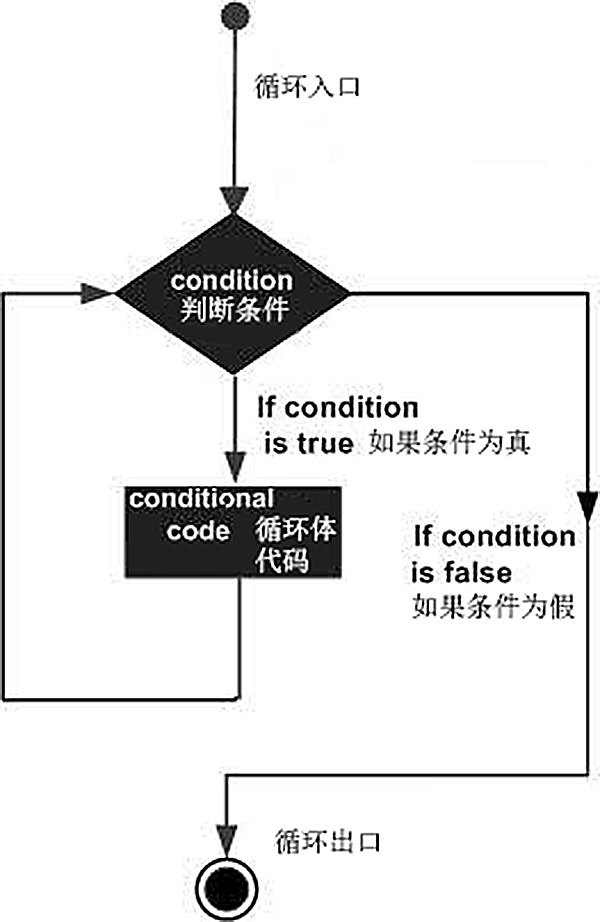
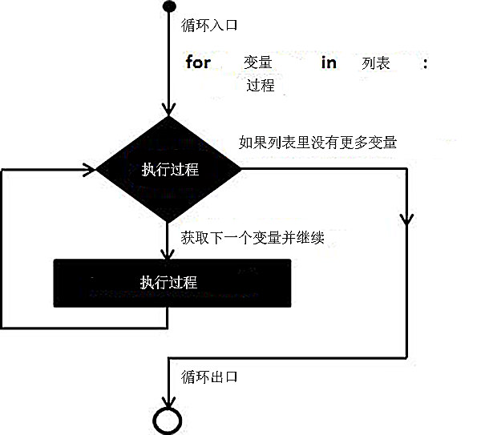
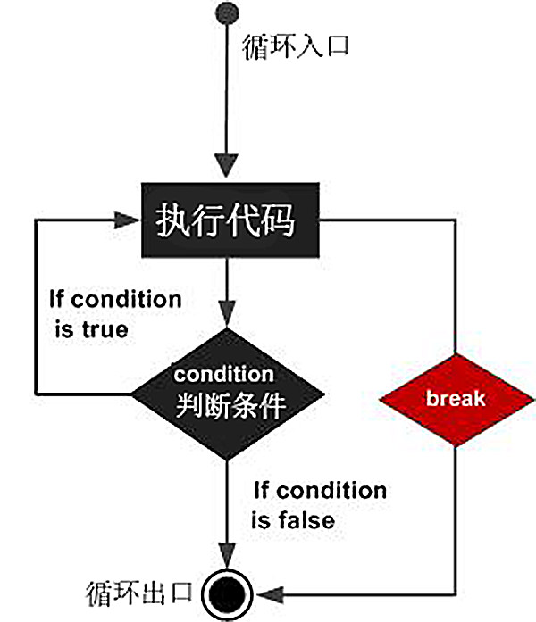
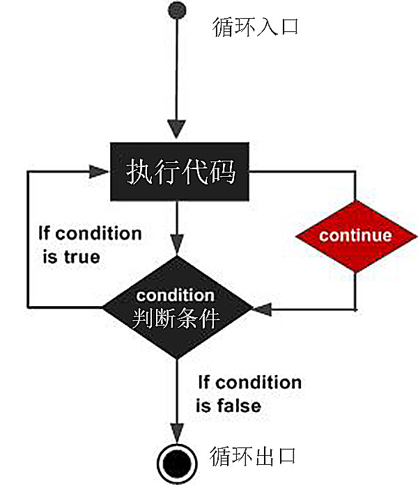

## 4.1 Python中的循环语句 ##
----------

- Python程序一般情况下都是按顺序执行的，然而程序中经常会遇到一些程序段需要反复执行多次，或者需要一直执行永不结束，这时候就需要更加复杂的程序执行路径，循环语句允许我们执行一个语句或语句组多次，下面是Python语言中的循环代码。

### While 循环语句 ###

- while循环为MicroPython中最常用的一个循环语句，执行流程图如下：



- while语句的用法是在某条件下，循环执行某段程序，以处理需要重复处理的相同任务。其基本形式为：

```python

while 判断条件：
	执行语句……
else :
	执行语句……

```

- 执行语句可以是单个语句或语句块。判断条件可以是任何表达式，任何非零、或非空（null）的值均为true。
- 具体使用方法示例如下：

```python

 
	count = 0
	while (count < 9):						#如果变量count小于9则执行以下代码
		display.show(count)					#输出count的值	
		count = count + 1					#count加1
	else:
		display.scroll("goodbye", delay=400)			#输出good bye

	#else可以简写省略，代码也可以写成如下：

	count = 0
	while (count < 9):						#如果变量count小于9则执行以下代码
		display.show(count)					#输出count的值	
		count = count + 1					#count加1
									#如果count值大于等于9则执行以下代码
		display.scroll("goodbye", delay=400)			#输出good bye

```
- 在MicroPython中，while循环语句最常用的方法为设置一个永真循环，一直运行某一段代码。例如：


```python


	while True：				#循环判断语句设为真，即为永久循环
		display.show(count)


```

***温馨提示：*** Python中代码执行严格对齐，例如while语句下要执行的代码需严格缩进一个Tab键。


### for 循环语句 ###

- for语句是Python中经常用于控制循环和使用循环变量的循环语句。执行流程图如下：




- for循环可以遍历任何序列的项目，如一个列表或者一个字符串。其基本形式为：


```python

	for 变量 in 列表:
		执行语句

```

- for循环的条件为变量遍历列表，当列表遍历结束循环结束。
- 具体使用方法示例如下：


```python

	for letter in 'Python':				#遍历字符串‘Python’
		print '当前字母 :', letter			#letter会循环赋值为‘P’‘y’‘t’‘h’‘o’‘n’


	fruits = ['banana', 'apple', 'mango']		#定义一个列表
	for fruit in fruits:  				#fruit会被循环赋值为‘banana’‘apple’‘mango’
		print '当前水果 :', fruit 


```


#### range 函数 ####
- 不管在什么计算机语言中for循环最经典的使用案例都是，冒泡排序，即将一个大小不同无序排列的列表，排序成一个有序的列表，而要完成这个功能需要使用到range()函数。
- range()函数用法：
```python

range(start, stop, step)

```
- start: 计数从 start 开始。默认是从 0 开始。例如range（5）等价于range（0， 5）;
- stop: 计数到 stop 结束，但不包括 stop。例如：range（0， 5） 是[0, 1, 2, 3, 4]没有5
- step：步长，默认为1。例如：range（0， 5） 等价于 range(0, 5, 1)
- 示例代码如下：

```python

range(10)        # 从 0 开始到 10
[0, 1, 2, 3, 4, 5, 6, 7, 8, 9]
range(1, 11)     # 从 1 开始到 11
[1, 2, 3, 4, 5, 6, 7, 8, 9, 10]
range(0, 30, 5)  # 步长为 5
[0, 5, 10, 15, 20, 25]

```
- 当我们理解了range()函数如何使用后再来看下冒泡排序的经典代码：

```python

	arays = [1, 8, 2, 6, 3, 9, 4]
	for i in range(len(arays)):
		for j in range(i+1):
			if arays[i] < arays[j]:		# 判断语句
            arays[i], arays[j] = arays[j], arays[i]  	# 实现两个变量的互换
# arays的值变为[1, 2, 3, 6, 8, 9]

```
### 循环嵌套及控制语句 ###

- Python 语言允许在一个循环体里面嵌入另一个循环，每一个循环体中都可以嵌套，在冒泡排序中，就是两个for循环嵌套排序，你可以在循环体内嵌入其他的循环体，如在while循环中可以嵌入for循环，反之，你可以在for循环中嵌入while循环。

```python

#for循环嵌套for循环
	for iterating_var in sequence:
		for iterating_var in sequence:
			statements(s)
		statements(s)

#while循环嵌套while循环
	while expression:
		while expression:
		statement(s)
	statement(s)


#while循环嵌套for循环
	while expression:
		for iterating_var in sequence:
			statements(s)
		statements(s)
```
#### break语句 ####

- break语句用来终止循环语句，打破了最小封闭for或while循环。即循环条件没有False条件或者序列还没被完全递归完，也会停止执行循环语句。



```python
	
	for letter in 'Python':				
		if letter == 'h':				# 当letter 等于 h字符的时候
			break						# 结束循环
			print '当前字母 :', letter
#输出结果为‘p’‘y’‘t’，h字符后因循环结束不输出。

```

#### continue 语句 ####

- continue 语句跳出本次循环，用来告诉Python跳过当前循环的剩余语句，然后继续进行下一轮循环，与其相似的break是跳出整个循环。



```python

	for letter in 'Python':     
		if letter == 'h':				# 当letter等于 h 字符的时候
		continue					# 跳过当前循环
	print '当前字母 :', letter
#输出结果为‘p’‘y’‘t’‘o’‘n’，h字符因循环被跳过不输出

```

#### pass 语句 ####

- Python pass是空语句，pass 不做任何事情，一般为了保持代码的完整性，以及提高可读性，当做占位语句。


