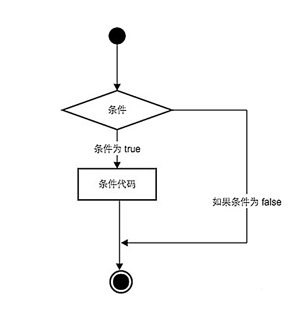

## 4.2 Python中的条件语句 ##
-----------------

- Python条件语句是通过一条或多条语句的执行结果（True或者False）来决定是否执行代码块。
- Python程序语言指定任何非 0 和非空（null）值为true，0 或者 null为false。
- 执行流程图如下：




### if条件语句 ###

- Python 编程中 if 语句用于控制程序的执行，基本形式为：
- 

```Python

if 判断条件：
	执行语句……
else：
	执行语句……

```

- 其中"判断条件"成立时（非零），则执行后面的语句，而执行内容可以多行，以缩进来区分表示同一范围。例如：

```python

name = 'python'
if name == 'python':					# 判断变量否为'python'
	flag = True					# 条件成立时设置标志为真
	print 'welcome python'				# 并输出欢迎信息

```

- else 为可选语句，当需要在条件不成立时执行内容则可以执行相关语句，具体例子如下：

```python
name = 'python'
if name == 'python':					# 判断变量否为'python',如果是执行以下代码
	flag = True					# 条件成立时设置标志为真
	print 'welcome python'				# 并输出欢迎信息
else							# 如果不是执行以下代码	
	flag = False					# 条件不成立时设置标志位假
	print 'name error'				# 并输出错误信息

```

- if 语句的判断条件可以用>（大于）、<(小于)、==（等于）、>=（大于等于）、<=（小于等于）来表示其关系。

- 当判断条件为多个值时，可以使用以下形式：`if-elif-else`

```python

if 判断条件1:
	执行语句1……
elif 判断条件2:
	执行语句2……
elif 判断条件3:
	执行语句3……
else:
	执行语句4……

```
示例如下：

```python

num = 5     
if num == 3:            # 判断num的值
	print 'boss'	# 等于3为BOSS
elif num == 2:		# 等于2为user
	print 'user'	# 等于1为worker
elif num == 1:
	 print 'worker'		
elif num < 0:           # 值小于零时输出error
	print 'error'
else:					
	print 'noting'	# 条件均不成立时输出

```
***温馨提示***：`elif `等同于其他语言中的`else if`。

#### 复合型if语句 ####
- if语句的条件语句可以复合逻辑运算符，判断更加复杂的情况。例如：

```python

a=0
b=10
if ( a > 5 ) and ( b > 5):
    print "double > 5"
elif( a > 5 ) or ( b > 5 ):
	print "one > 5"
else :
    print "no"

#输出 one > 5
```
