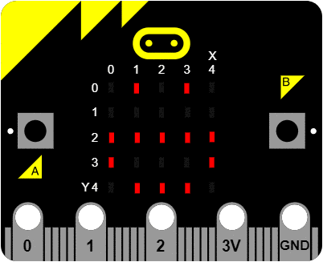

## 4.4 演示案例 ##
----------
#### 判断AB键是否按下 ####
- 使用while循环和if语句和is_pressed()来完成一个判断按键是否按下的案例。

```python

from microbit import *
while True:
	if button_a.is_pressed() and button_b.is_pressed():			# 如果 A 和 B 同时按下
		display.scroll("AB")						# 显示 AB
		break								# 退出循环
    elif button_a.is_pressed():							# 如果 A 按下
        display.scroll("A")							# 显示 A
    elif button_b.is_pressed():
        display.scroll("B")
    sleep(100)									# 暂停100ms

```

#### 开心还是难过 ####
- 用get_presses()和列表完成一个开心难过的表情切换，按左键

```python

from microbit import *

horror = Image("09090:00000:09990:90009:99999")					# 十分难过
better_meh = Image("00000:09090:00000:99999:00000")				# 心情一般
joy = Image("09090:00000:99999:90009:09990")					# 十分开心

emotions = [horror, Image.SAD, better_meh, Image.HAPPY, joy]			# 表情的五种状态
current_emotion = 2								# 初始化表情为一般

while True:
    if button_a.get_presses():							# A按钮按下变难过
        current_emotion = max(current_emotion - 1, 0)
    elif button_b.get_presses():
        current_emotion = min(current_emotion + 1, 4)				# B按钮按下变开心
    display.show(emotions[current_emotion])


```


