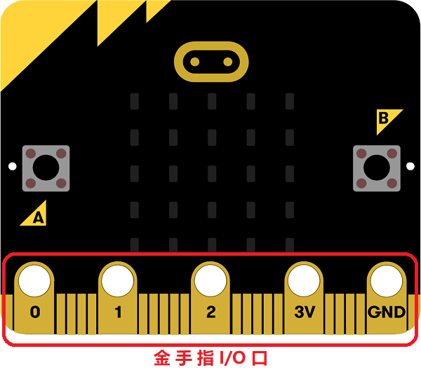
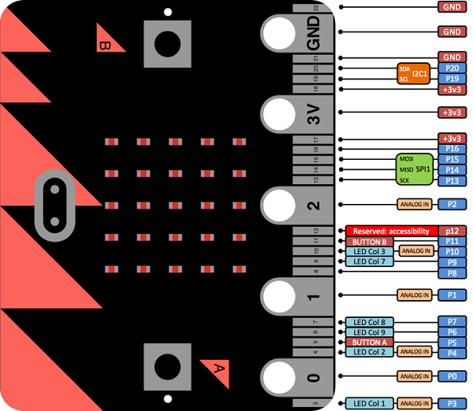

## 5.1 什么是输入输出引脚 ##
-----------------

- Micro:bit的底边有一条金属条，看起来好像是设备的牙齿，但是这金色“牙齿”条带不仅仅为了时髦，它们还可以用来将你的micro：bit挂钩到各种各样的电子产品上，这些是输入/输出引脚（或简称I / O引脚）。

***温馨提示***：金手指由众多金黄色的导电触片组成，因其表面镀金而且导电触片排列如手指状，所以称为“金手指”。

### I/O口详细介绍 ###

- Micro:bit提供了19个IO口可以选择，编号为0-16和19-20，17和18号为供电口不能使用。具体介绍如图：

- Micro:bit可以直接使用`pin0`-`p20`来操作端口，每个端口在板载所使用的情况如下：

|Pin|	Type	|Function|
|:--------:|:--------:|:------:|
|0	|Touch(Analog)|Pad 0|
|1	|Touch(Analog)|Pad 1|
|2	|Touch(Analog)|Pad 2|
|3	|Analog	|Column 1|
|4	|Analog	|Column 2|
|5	|Digital|Button A|
|6	|Digital|Row 2	|
|7	|Digital|Row 1	|
|8	|Digital|未使用	|
|9	|Digital|Row 3	|
|10	|Analog	|Column 3|
|11	|Digital|Button B|
|12	|Digital|未使用	|
|13	|Digital|SPI MOSI|
|14	|Digital|SPI MISO|
|15	|Digital|SPI SCK|
|16	|Digital|未使用	|
|19	|Digital|I2C SCL|
|20	|Digital|I2C SDA|
- 当经过多次的测试和使用极易受损，推荐使用金手指转接板保护金手指。 淘宝连接：恩孚科技[金手指转接板Elecfreaks.taobao.com](https://item.taobao.com/item.htm?spm=a1z10.5-c-s.w4002-18602834185.17.19563ec6LOw7hi&id=572043966476)
- 板载I/O口只有pin0、pin1、pin2方便使用鳄鱼夹连接，其余I/O口因接触面积太小无法连接，推荐使用I/O扩展板将I/O引出方便连接任何模块，淘宝连接：恩孚科技[传感器扩展版](https://item.taobao.com/item.htm?spm=a1z10.5-c-s.w4002-18602834185.53.389841234w1AJZ&id=572685991359)

### 禁用默认功能 ###

- 使用功能周围用括号标记的引脚需要禁用该引脚的默认功能，然后才能使用其他功能。

一、引脚：P3，P4，P6，P7，P9，P10：

- 这些引脚耦合到LED矩阵显示器，并且还可以完成其相关的环境光测试模式，直接使用引脚会因为LED矩阵显示器图案变化导致电平改变，需要先禁用掉LED显示功能，要禁用显示功能（将自动禁用光感应功能），请调用`display.enable(false)`。稍后需要再次打开显示驱动程序，请调用`display.enable(true)`。

- 另请注意，LED 矩阵将LED与相关电阻连接在这些引脚上，因此在设计将这些引脚用于其他用途的电路时应考虑到这一点。

二、引脚：P5，P11：

- 这些引脚分配给两个板载按钮。在使用所有标准高级语言的默认设置中，有一个包含：`uBit.buttonA`，`uBit.buttonB`和的全局`uBit`实例`uBit.buttonAB`。

- 按钮在其构造函数中挂钩到系统计时器中以进行常规的去抖动。但是，如果要完全删除此功能并将物理引脚用于其他目的，`delete uBit.buttonA`则可以调用C ++析构函数并从系统计时器中取消注册按钮实例，从而有效地禁用该引脚的所有活动。然后可以使用MicroBitPin物理引脚名称周围的实例直接控制它而不受干扰。

- 但请注意，Micro:bit板上安装了10K外部上拉电阻。

三、引脚：P19，P20

- 这些引脚分配给I2C总线，由板载加速度计和磁力计设备使用。强烈建议您避免将这些引脚用于I2C以外的任何功能。 

- 可以禁用使用这些引脚作为I2C总线的服务，但加速度计和磁力计设备仍将连接到总线，并可能尝试将信号解释为数据有效负载，这可能会产生一些不良副作用。 SDA和中断引脚。板上的两个引脚都安装了4K7上拉电阻，因此这两个信号的最佳用途是添加其他I2C器件。
