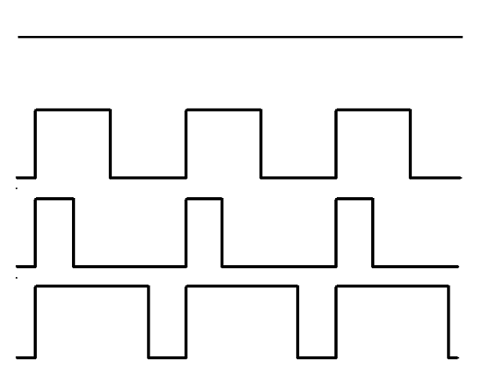

# 5.2 PWM及相关API

## 数字和模拟 ###

- 在介绍API之前，先了解一下什么叫数字接口，什么叫模拟接口。

### 数字接口Digital ###

- 数字接口的参数及返回值只有计算机值 0 和 1 ，1 代表高电平（3.3v），0 代表低电平（0v）。
- 在micro:bit主板上大多数为数字接口。

### 模拟接口Analog ###

- 模拟接口可以在0-3.3v之间选择一个电压，参数及返回值为0(0v)-1023(3.3v).

- micro:bit板载的P0、P1、P2、P3、P4、P10为模拟口，其他均为数字接口。

### PWM脉冲宽度调制 ###

- Micro:bit引脚只能设置为3.3V输出，或者将其下拉至0V。如果想要设置一个1.65v的输出，可以通过非常快速地接通和断开该电压来控制，控制它的开启时间和关闭时间，调节电压值，这种技术称为脉冲宽度调制（PWM），这就是write_analog方法。

可以在上面看到四种不同PWM信号的图表。它们都具有相同的周期（因此具有频率），但它们具有不同的占空比。

第一个产生的信号是3V。

第二个产生的信号是write_analog(511)，它恰好具有50％的占空比，在一半的时间内为3.3v，而在一半的时间内为0v。结果是该信号的输出1.65V而不是3.3V。

第三个信号具有25％的占空比，生成信号用write_analog(255)。同上所述，该引脚上输出0.825V。

第四个信号具有75％的占空比，生成信号用write_analog(767)。它的能量是第三个信号的三倍，相当于输出2.475V。

### I/O口相关API ###

| API | 描述 | 适用端口|
| :------------: | :-----------: |:-----------: |
|`read_digital()`|向I/O口写入一个数字值，0 或者 1| 数字接口|
|`write_digital()`|从I/O口读取一个数字返回值，0 或者 1|数字接口|
|`read_analog()`|从I/O口读取一个模拟返回值，0到1023之间|模拟接口 
|`write_analog(val)`|向I/O口写入一个模拟值(`val`)(PWM信号)|模拟接口|
|`set_analog_period（val）`|将输出的PWM信号的周期设置为`val`以毫秒为单位。最小有效值为1ms。|模拟接口|
|`set_analog_period_microseconds(val)`|将输出的PWM信号的周期设置为`val`以纳秒为单位。最小有效值为256µs。|模拟接口|
|`is_touched()`|端口是否被触摸，因为人接触大地，所以会把I/O口电压拉低。|模拟接口|

***温馨提示***：Micro:bit仅在P0、P1、P2上安装了上拉电阻，以便触摸感应起作用。
