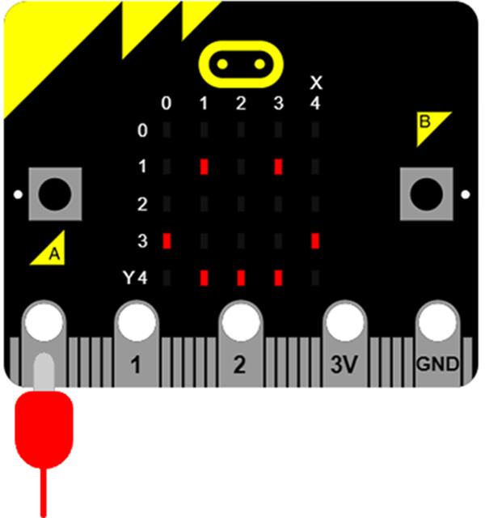

# 5.3 演示案例

### 抚摸micro:bit ###

- 抚摸P0口，micro:bit会变成一个笑脸。因为人体电阻很大，触摸P0口会将电平拉低，导致电平变化。

```python

from microbit import *

while True:
    if pin0.is_touched():
        display.show(Image.HAPPY)
    else:
        display.show(Image.SAD)

```
***温馨提示***：如果没有变化可以另一只手捏住GND端口，降低电平。



### 触摸开关 ###

- 将led电源线使用鳄鱼夹接到P2口，接地端接到GND口，触摸P1口，LED灯亮起。

```python

from microbit import *

pin2.write_digital(0)

while True:
    if pin1.is_touched():
        pin2.write_digital(1)
    else:
        pin2.write_digital(0)

```


