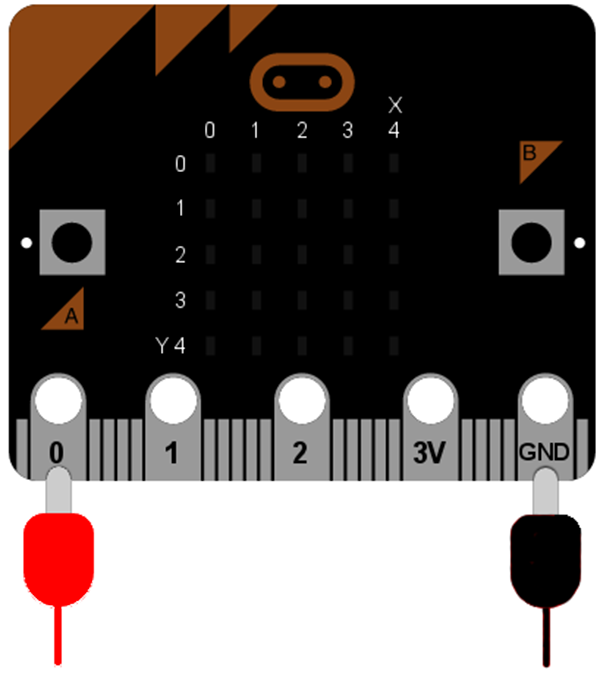
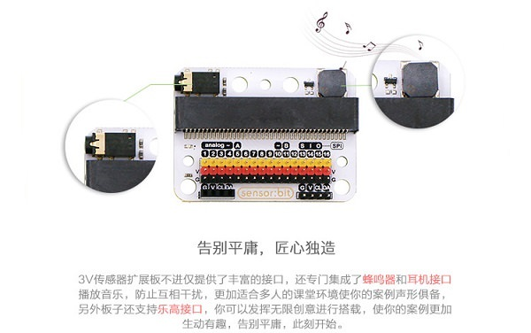

# 6.1 蜂鸣器

- Micro:bit支持各种音乐播放，不论是内置音乐还是简单的音调，或者由简单音调组成的曲目，Micro:bit主板不包含扬声器，所以需要外接扬声器实现播放。
- 音乐是不同音调的排列组合，而要发出不同音调则需要一个可以调节声音的蜂鸣器。

### 蜂鸣器 ###

- 蜂鸣器是一种发声器件，它由振动装置和谐振装置组成。按照控制方式分类，可把蜂鸣器又分为有源型与无源型。

- 有源型蜂鸣器的工作发声原理是：蜂鸣器内部集成振荡系统与放大取样电路，当有直流电源通过蜂鸣器时会使谐振装置产生声音信号，有源型蜂鸣器的工作发声原理图如下：

- 无源型蜂鸣器的工作发声原理是：方波信号输入谐振装置转换为声音信号输出，无源型蜂鸣器的工作发声原理图如下：

- 将蜂鸣器的一端连接到P0，另一端连接到GND。

**注意：**为了使音调可以变化请不要使用有源蜂鸣器。

***温馨提示：***为了更好的学习交流，推荐使用sensor:bit扩展板，板载蜂鸣器，IO口扩展。购买地址：[EF恩孚科技淘宝专卖店](https://item.taobao.com/item.htm?spm=a1z10.5-c-s.w4002-18602834185.38.1e274123DqH0Pt&id=572685991359)

