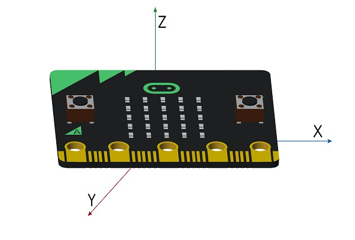

# 7.2 加速度计

- micro:bit主板上配备有一个加速度计，可以测量X,Y,Z轴的运动，横向左右移动为X轴，纵向前后移动为Y轴，高低上下移动为Z轴，可以很好的检测mincro:bit在空间中的位置以及移动方向。每一根轴都有一种方法，返回一个整数或者负数，当读数为0的时候，在该轴方向是水平的。



### 加速计API ###

| API | 描述 | 
| :------------: | :-----------: |
|`microbit.accelerometer.get_x()`|读取X轴读数，返回值为一个整数。|
|`microbit.accelerometer.get_y()`|读取Y轴读数，返回值为一个整数。|
|`microbit.accelerometer.get_z()`|读取Z轴读数，返回值为一个整数。|
|`microbit.accelerometer.get_values()`|一次性读取XYZ三个轴的数据，保存为一个元组。|
|`microbit.accelerometer.current_gesture()`|返回当前手势的名称。|
|`microbit.accelerometer.is_gesture(val)`|返回True或者False指示当前手势名`val`是否处于活动状态。|
|`microbit.accelerometer.was_gesture(val)`|返回True或者False指示当前手势名`val`自上次调用以来是否处于活动状态。|
|`microbit.accelerometer.get_gesture()`|返回历史手势元组，元组第一位为最新手势，并且清除历史记录。|


### 示例：不想站起来 ###

- 根据如上API，编写一段小程序，当micro:bit主板平放时显示一个笑脸，当把主板拿起来显示一个难过脸。它只想躺着。

```python

from microbit import *

while True:
    gesture = accelerometer.current_gesture()
    if gesture == "face up":
        display.show(Image.HAPPY)
    else:
        display.show(Image.SAD)

```
