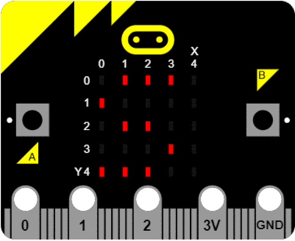

# 7.5 课后练习

一、游戏：大转盘

- 游戏初始：随机显示一个CLOCKS指针以指示方向。
- 游戏进行：摇动micro:bit，指正开始旋转。
- 游戏结束：指针转动随机圈后停止指向某一个位置。

二、方向指示器

- 初始化指南针后，micro:bit指向某个方向在点阵显示屏上显示:
- 东 east(E), 西 west(W), 南 south(S), 北 north(N)
- 东南 east south(ES) 东北east north(EN) 西南west south(WS) 西北west north(WN)

